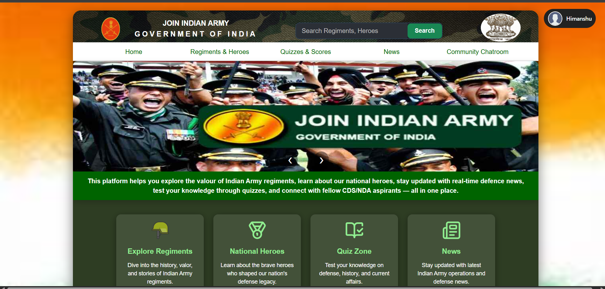
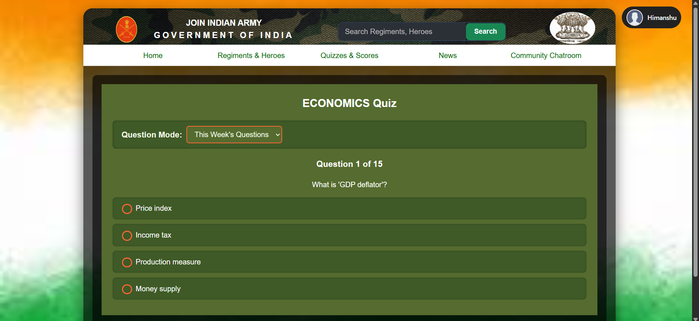
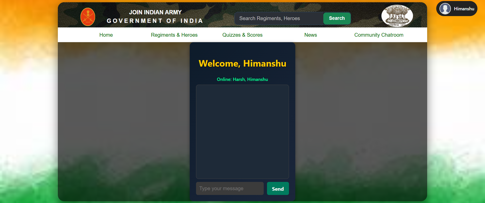

#  VeerNet - Indian Army Themed Learning Portal

A tribute to our Indian Armed Forces. A web app built for aspirants preparing for CDS/NDA/AFCAT. Features quizzes, regimental info, defence news, and a Firebase-powered chatroom.

🔗 *Live Website*:
[https://veer-net-application.vercel.app](https://veer-net-application.vercel.app) 
🛠 *Backend API*: 
[https://veer-backend-pa05.onrender.com](https://veer-backend-pa05.onrender.com)

## ✨ Features

- 🧠 CDS/NDA Weekly Quizzes (Leaderboard + Review)
- 📰 Defence News Feed (Filterable + Sorted)
- 🪖 Regiments & Heroes Information
- 💬 Firebase Chatroom for Community
- 🔐 Login / Signup Auth System
- 📊 Google Sheets API Integration for Dynamic Quiz Data

## 📸 Screenshots

### Home Page

### Quiz Page

### Chatroom

### tech stack table
Frontend	     React, Vite, Tailwind CSS
Backend	         Node.js, Express.js
Database	     MongoDB
Authentication	 JSON Web Token (JWT)
APIs & Sheets	 Google Sheets API
Real-Time Chat	 Firebase (for chatroom and real-time messages)
Deployment	Vercel (Frontend), Render (Backend)

## 🛠 Getting Started

### Frontend Setup

git clone https://github.com/himanshugupta7777/veer-net-client.git
cd veer-net-frontend
npm install
npm run dev

### Backend Setup

git clone https://github.com/himanshugupta7777/veer-backend.git
cd veer-net-backend
npm install
npm start

## 🔐 Environment Variables

### Backend (.env)

MONGO_URI=your_mongo_connection_string
SHEET_ID=your_google_sheet_id

GOOGLE_TYPE=service_account
GOOGLE_PROJECT_ID=your_project_id
GOOGLE_PRIVATE_KEY_ID=your_key_id
GOOGLE_PRIVATE_KEY="your_private_key"
GOOGLE_CLIENT_EMAIL=your_client_email
GOOGLE_CLIENT_ID=your_client_id
GOOGLE_AUTH_URI=https://accounts.google.com/o/oauth2/auth
GOOGLE_TOKEN_URI=https://oauth2.googleapis.com/token
GOOGLE_AUTH_PROVIDER_CERT_URL=https://www.googleapis.com/oauth2/v1/certs
GOOGLE_CLIENT_CERT_URL=your_cert_url
GOOGLE_UNIVERSE_DOMAIN=googleapis.com

### Frontend (.env)

VITE_API_BASE_URL=https://veer-backend-pa05.onrender.com

